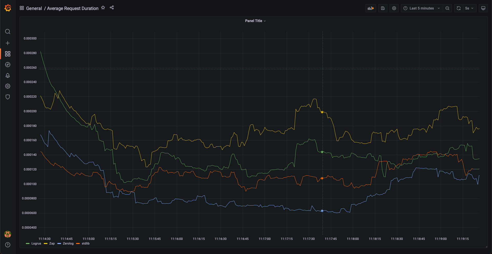

# Golang Logger Performance Demo

The repo compares the performance of [rs/zerolog](https://github.com/rs/zerolog), [sirupsen/logrus](https://github.com/sirupsen/logrus), [uber/zap](https://github.com/uber-go/zap) and the [stdlib logger](https://pkg.go.dev/log).

## Setup

1. Run docker-compose up --build
2. Send HTTP requests to:
   - `http://localhost:8080/zerolog`
   - `http://localhost:8080/zap`
   - `http://localhost:8080/logrus`
   - `http://localhost:8080/stdlib`
3. navigate to `http://localhost:8000` 
4. import the Grafana dashboard

## Results

1. zerolog
2. stdlib
3. logrus
4. zap